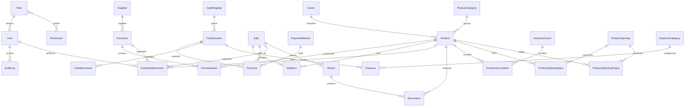

# Modelo de Datos

## Principios

- El stock no es editable manualmente.
- La fuente de verdad del stock son los movimientos de inventario.
- Si existe una tabla o campo resumido de stock, debe ser derivado, transaccional y reconstruible.
- Los documentos comerciales confirmados no se eliminan fisicamente.
- Los montos se guardan como enteros en CLP.
- Los identificadores internos no dependen de correlativos visibles.

## Entidades principales

### Usuarios y permisos

- `User`: cuenta local, nombre, email opcional, passwordHash, rol, estado, fechas.
- `Role`: administrador, encargado, vendedor.
- `Permission`: permisos atomicos para validacion en servidor.

### Catalogo

- `Product`: SKU unico e inmutable, codigo de barras opcional, nombre, juego, categoria, subcategoria, edicion, marca, idioma, condicion, rareza, variante, tipo, costos, precio, stock minimo, estado, notas.
- `ProductCategory`: categorias y subcategorias.
- `Game`: juegos TCG o lineas comerciales.
- `Supplier`: proveedores.

### Compras

- `Purchase`: numero interno, proveedor, documento, fechas, usuario, estado, subtotal, descuentos, costos adicionales, total, observaciones.
- `PurchaseItem`: producto, cantidad, costo unitario, subtotal.

### Ventas y pagos

- `Sale`: correlativo visible, fecha, usuario, caja, totales, costo estimado, margen, estado, observaciones.
- `SaleItem`: producto, cantidad, precio original, descuento, precio final, costo unitario historico.
- `Payment`: venta, medio, monto, referencia, usuario, sesion de caja.
- `PaymentMethod`: efectivo, debito, credito, transferencia, otro.

### Inventario

- `InventoryMovement`: producto, cantidad, tipo, fecha, usuario, origen, motivo, observaciones, stock anterior, stock resultante, operacion relacionada, movimiento revertido.
- `InventoryCount`: sesion de conteo fisico, estado, usuario creador, aprobador, fechas.
- `InventoryCountItem`: producto, stock teorico, stock contado, diferencia, motivo.

### Caja y gastos

- `CashRegister`: caja o terminal.
- `CashSession`: apertura, cierre, fondo inicial, efectivo esperado, contado, diferencia, estado.
- `CashMovement`: ingresos, retiros, gastos, devoluciones, vuelto y ajustes de caja.
- `Expense`: gasto operacional, monto, categoria, medio de pago, sesion de caja si aplica, estado.
- `ExpenseCategory`: categorias configurables.

### Devoluciones

- `Return`: venta original, usuario, fecha, motivo, forma de reembolso, estado.
- `ReturnItem`: producto, cantidad, destino del producto devuelto, monto reembolsado.

### Operaciones especiales

- `ProductOpening`: apertura de sellado, usuario, fecha, motivo, costo total, metodo de asignacion.
- `ProductOpeningInput`: producto sellado consumido y cantidad.
- `ProductOpeningOutput`: producto obtenido, cantidad, costo asignado.

### Auditoria y configuracion

- `AuditLog`: usuario, accion, entidad, id entidad, fecha, datos anteriores, datos posteriores, motivo, terminal o IP.
- `SystemSetting`: clave, valor, tipo, descripcion.

## Diagrama de entidades

## Tipos de movimientos de inventario

- Compra recibida.
- Venta.
- Devolucion de cliente.
- Devolucion a proveedor.
- Producto danado.
- Merma.
- Uso interno.
- Premio de torneo.
- Apertura de producto sellado.
- Ingreso de singles obtenidos mediante apertura.
- Ajuste positivo por inventario fisico.
- Ajuste negativo por inventario fisico.
- Anulacion de compra.
- Anulacion de venta.
- Transferencia o reclasificacion.
- Movimiento compensatorio.

## Indices iniciales

- `Product.sku` unico.
- `Product.barcode` unico opcional cuando exista.
- `InventoryMovement.productId, createdAt`.
- `Sale.createdAt, status`.
- `SaleItem.productId`.
- `Payment.saleId`.
- `Payment.paymentMethodId, createdAt`.
- `CashSession.cashRegisterId, status`.
- `Purchase.supplierId, status, receivedAt`.
- `AuditLog.entity, entityId, createdAt`.

